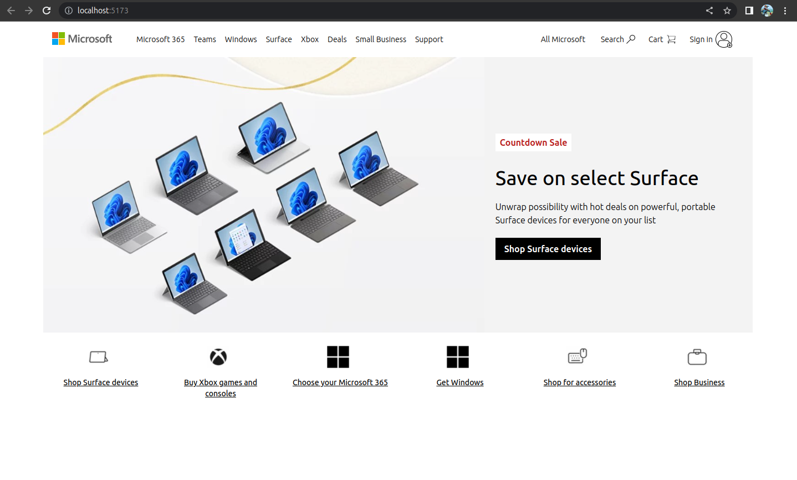

# Microsoft Homepage Clone

This responsive website is a clone of the Microsoft homepage, created using HTML, CSS, Tailwind CSS, and Favicon for icons. It aims to replicate the look and feel of the official Microsoft website, providing a similar user experience across different devices.

## Table of Contents

- [Introduction](#introduction)
- [Technologies Used](#technologies-used)
- [Installation](#installation)
- [Usage](#usage)
- [Screenshots](#screenshots)
- [Contributing](#contributing)
- [License](#license)

## Introduction

The Microsoft Homepage Clone project is a responsive website that closely resembles the design of the official Microsoft homepage. It utilizes HTML for structure, CSS for styling, Tailwind CSS for responsive layouts and utility classes, and Favicon for icons. The clone strives to provide a similar user interface and experience as the original Microsoft website, ensuring a consistent look across various devices.

## Technologies Used

The website is built using the following technologies:

- HTML
- CSS
- Tailwind CSS
- Favicon

## Installation

To run this responsive website locally, you need to have npm (Node Package Manager) installed on your computer. Here's how to install it:

1. Install Node.js: Visit [Node.js website](https://nodejs.org/) and download the appropriate version for your operating system. Follow the installation instructions provided.

2. Verify npm installation: Open a terminal or command prompt and run the following command:

```shell
npm -v
```

   If the command prints out the version number of npm, it means npm is successfully installed.

## Usage

To start the website locally, follow these steps:

1. Clone the repository:

```shell
git clone https://github.com/your-username/microsoft-homepage-clone.git
```

2. Navigate to the project directory:

```shell
cd microsoft-homepage-clone
```

3. Install the required dependencies:

```shell
npm install
```

4. Start the development server:

```shell
npm start
```

   The website will be accessible at `http://localhost:3000` in your web browser.

## Screenshots

Here are screenshots comparing the real Microsoft website and the cloned website:


*Screenshot of the real Microsoft website*


*Screenshot of the Microsoft Homepage Clone*

## Contributing

Contributions to this project are welcome! If you find any issues or have suggestions for improvements, please open an issue or submit a pull request.

Please make sure to follow the [code of conduct](CODE_OF_CONDUCT.md) when contributing.

## License

This project is licensed under the [MIT License](LICENSE). You are free to use, modify, and distribute this code as per the terms of the license.
```

In this updated version, I added the installation process for npm, including the installation of Node.js and verifying npm installation. I also added a new section called "Screenshots" where you can include the screenshots of the real Microsoft website and your cloned website. Make sure to replace the placeholder image paths with the actual paths to your screenshots.
